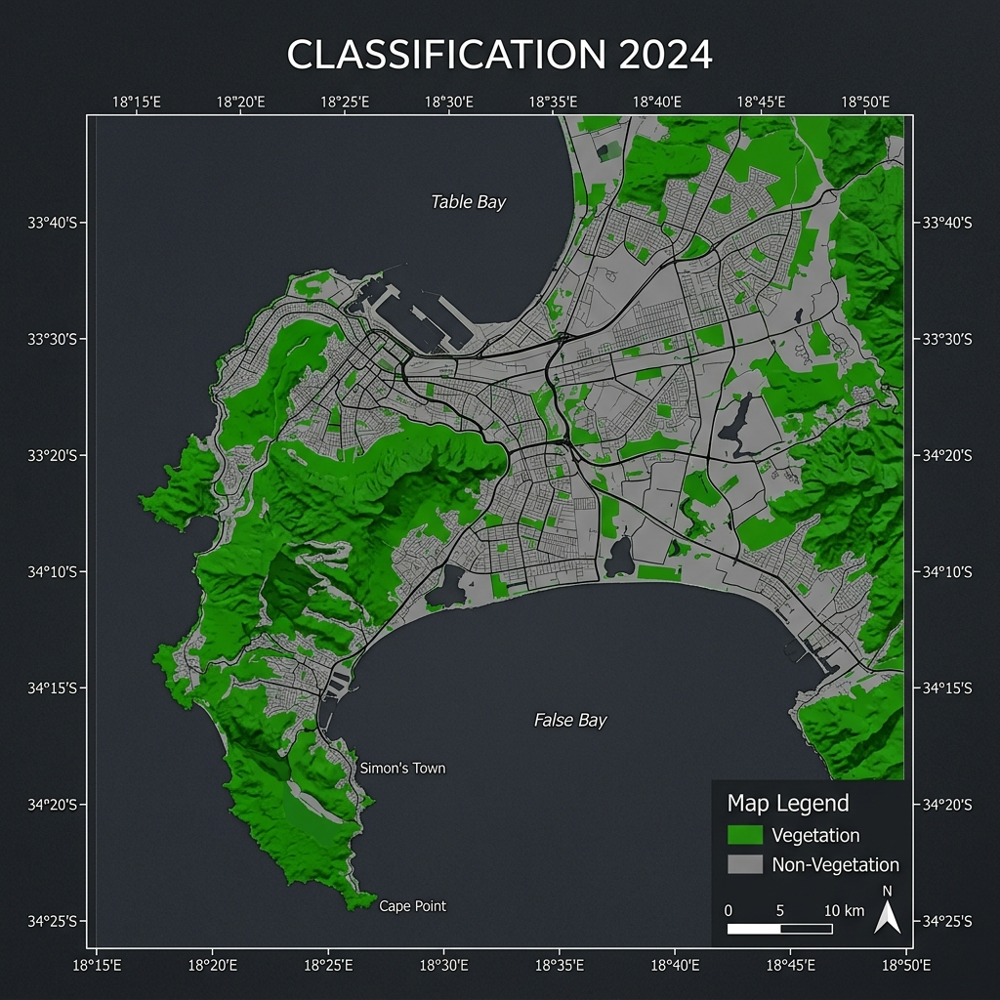
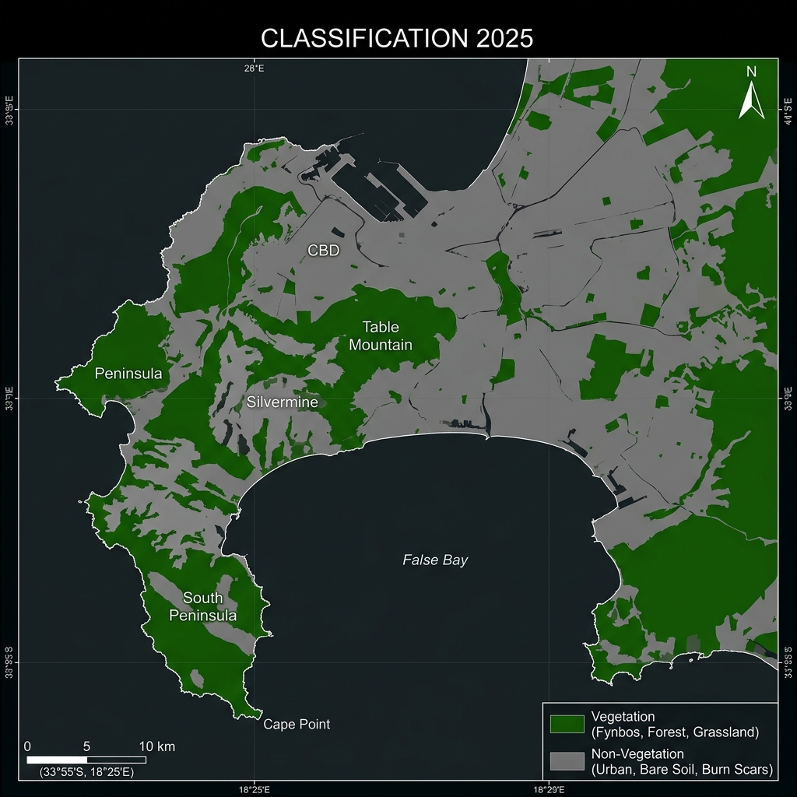
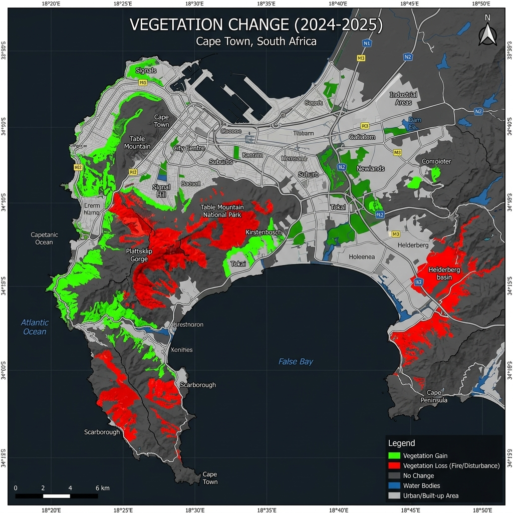

# GeoAI WebGIS — Vegetation Change Analysis of Cape Town (2024–2025)

[](https://leafletjs.com)
[](https://www.chartjs.org)
[](https://getbootstrap.com)
[](./LICENSE)

A production-quality, responsive WebGIS application and dashboard built for analyzing wildfire-driven and anthropogenic vegetation changes in Cape Town, South Africa, between 2024 and 2025. This project uses Sentinel-2 multispectral imagery and a supervised Random Forest classifier to map land cover transitions.

---

## 🎯 Objectives & Study Area

### Project Objectives
1.  **Map Vegetation Cover:** Classify vegetation and non-vegetation land cover classes across Cape Town for the years 2024 and 2025 using Sentinel-2 MSI median composites.
2.  **Detect Land Cover Change:** Perform post-classification change detection to identify areas of vegetation loss, vegetation gain, permanent vegetation, and permanent non-vegetation.
3.  **Evaluate Model Performance:** Train a Random Forest classifier (100 trees) on ground-truth points and validate results using independent testing samples to measure Accuracy, Precision, Recall, and F1-score.
4.  **Visualize through WebGIS:** Build an interactive, client-side WebGIS application to display geospatial layers, summary statistics, and model performance metrics dynamically.

### Study Area: Cape Town, South Africa
*   **Geographic Focus:** Metropolitan Municipality of Cape Town.
*   **Ecology:** Home to the megadiverse and fire-prone Cape Floristic Region (Fynbos biome).
*   **Significance:** Wildfires during summer seasons frequently burn large swaths of fynbos shrubland and commercial plantations, making rapid remote-sensing change detection critical for rehabilitation and hazard planning.

---

## 🗺️ Live Features

| Feature | Description |
|---------|-------------|
| 🌍 **Interactive Map** | Leaflet.js with 4 basemaps (Esri Imagery, OSM, Esri Streets, CartoDB Dark). |
| 🌿 **Vegetation Layer** | High-performance GeoJSON display categorized by change codes, with interactive popup tooltips and hover highlights. |
| 🔍 **Search Control** | Integrated Nominatim-based location geocoding for flying directly to specific addresses or districts. |
| 📏 **Measurement Tool** | Custom distance and area calculators directly embedded in the map UI. |
| 🎛️ **Opacity Slider & Layer Filters** | Fine-grained transparency adjustments and class visibility toggles in a floating filter panel. |
| 📊 **Model Metrics Dashboard** | Confusion matrix grid, metrics radar, classification distribution pie chart, and progress bars. |
| 📈 **Insights & Trends** | Interactive donut charts, comparison bar charts, summary tables, and auto-generated analytical findings. |
| 🌙 **Theme Toggles** | Dark and light glassmorphism styles with persistent state storage. |
| 📱 **Responsive Design** | Collapsible sidebar and responsive grid layout adjusting seamlessly from mobile viewports to ultra-wide displays. |

---

## 📸 Screenshots & Outputs

### Land Cover Classification (2024)


### Land Cover Classification (2025)


### Vegetation Change Map (2024–2025)


---

## 🏗️ Project Structure

```
GeoAI-CapeTown-WebGIS/
├── index.html               # Single-page application shell
├── css/
│   └── style.css            # Full design system (custom variables, dark/light mode, glassmorphism)
├── js/
│   ├── utils.js             # Formatting, math, and chart-utility functions
│   ├── loader.js            # Config data bootstrap (asynchronously loads metrics, stats, and project JSONs)
│   ├── map.js               # Leaflet map, basemaps, search, measurement, and GeoJSON layer groups
│   ├── charts.js            # Chart.js renderers (radar, donut, horizontal comparison, pie charts)
│   ├── dashboard.js         # Modular HTML generators for all 5 navigation tabs
│   └── main.js              # Application coordinator, routing, theme initialization, and sidebar event listeners
├── assets/
│   └── workflow.png         # GEE processing pipeline diagram
├── config/
│   ├── metrics.json         # RF model training parameters and performance scores
│   ├── statistics.json      # Area change statistics (hectares and percentages)
│   └── project_info.json    # Project metadata, study area, and authors list
├── data/
│   ├── Classification_CapeTown_2024.tif   # 2024 land classification raster (3.7 MB)
│   ├── Classification_CapeTown_2025.tif   # 2025 land classification raster (3.5 MB)
│   └── Perubahan_Vegetasi_CapeTown_2024_2025.geojson  # Change polygon vectors (42 MB)
├── results/
│   ├── classification2024.png             # Cartographic map export for 2024
│   ├── classification2025.png             # Cartographic map export for 2025
│   └── change_map.png                     # Cartographic map export for vegetation change
└── README.md
```

---

## 🚀 Quick Start & Installation

Because this is a pure client-side WebGIS application, it does not require server-side compilation (e.g., Node.js or PHP). However, due to CORS (Cross-Origin Resource Sharing) restrictions on loading large local GeoJSON files, **you must serve the project from an HTTP server**.

### Step 1: Clone the Repository
```bash
git clone https://github.com/haryoraafi/GeoAI-CapeTown-WebGIS.git
cd GeoAI-CapeTown-WebGIS
```

### Step 2: Serve the Files
Choose one of the following methods to host the project locally:

#### Method A: VS Code Live Server (Recommended)
1.  Open the workspace folder in **VS Code**.
2.  Install the **Live Server** extension (by Ritwick Dey).
3.  Right-click `index.html` in the file explorer and select **Open with Live Server**.
4.  The app will launch at `http://127.0.0.1:5500`.

#### Method B: Python HTTP Server (Zero Install)
If you have Python installed, run this command in your terminal:
```bash
# For Python 3
python -m http.server 8080
```
Then open your browser and navigate to: `http://localhost:8080`

#### Method C: Node.js Serve (Command Line)
```bash
npx serve .
```

---

## 📊 Model Evaluation Summary (from `config/metrics.json`)

The Random Forest model was trained on **300 samples** split **70:30** into training and testing datasets.

| Metric | Score / Value | Description |
|--------|:---:|-------------|
| **Accuracy** | **90.7%** | Overall correct classifications |
| **Precision** | **94.6%** | Probability that predicted vegetation is correct |
| **Recall** | **85.4%** | Probability that actual vegetation was detected |
| **F1-Score** | **89.7%** | Harmonic mean of Precision and Recall |
| **Random Seed** | 42 | Key parameter for train/test split reproducibility |
| **Estimators** | 100 | Total trees constructed in the RF classifier |

### Confusion Matrix
*   **True Positives (TP):** 43 (Vegetation correctly identified)
*   **True Negatives (TN):** 35 (Non-vegetation correctly identified)
*   **False Positives (FP):** 6 (Non-vegetation misclassified as vegetation)
*   **False Negatives (FN):** 2 (Vegetation missed by the model)

---

## 📈 Statistics & Findings (from `config/statistics.json`)

Analysis of land transition categories reveals a significant decline in vegetation:

*   **Vegetation Extent (2024):** 81,040 ha
*   **Vegetation Extent (2025):** 65,566 ha
*   **Vegetation Gain:** +4,200 ha (reforestation, agricultural cycles, or regrowth)
*   **Vegetation Loss:** −19,673 ha (primarily due to devastating wildfire events)
*   **Net Area Change:** **−15,474 ha (−19.1% net reduction)**

---

## 👥 Authors & Team Members
This final project was completed by the following team:
1.  **Anggota 1: Lead Spatial Data Engineer**
    *   **Jobdesk Utama:** Menentukan wilayah studi (kota/kabupaten) dan memastikan batas administrasi jelas. Melakukan query citra Sentinel-2 (2024 & 2025), menerapkan cloud masking, menciptakan median composite, serta melakukan clipping wilayah.
2.  **Anggota 2: Ground Truth Specialist**
    *   **Jobdesk Utama:** Membuat minimal 300 titik sampel observasi berlabel (seimbang antara target kelas 1 dan non-target kelas 0) untuk tahun 2024 dan 2025. Memastikan sebaran titik merata di seluruh kota (pusat, pinggiran, berbagai kondisi).
3.  **Anggota 3: Machine Learning Engineer**
    *   **Jobdesk Utama:** Menulis kode GEE untuk melakukan split data otomatis (70% training, 30% testing) menggunakan seed tetap. Melatih model Random Forest dengan konfigurasi 100 trees dan melakukan klasifikasi citra dua tahun menggunakan model yang sama.
4.  **Anggota 4: Model Evaluation & Change Analyst**
    *   **Jobdesk Utama:** Menguji model dengan data testing, membuat confusion matrix, dan menghitung metrik APRF. Melakukan deteksi perubahan (change detection), menghitung luas pertambahan (gain), penyusutan (loss), perubahan bersih (net change), serta mengonversinya menjadi poligon vektor.
5.  **Anggota 5: WebGIS Developer**
    *   **Jobdesk Utama:** Membangun aplikasi WebGIS interaktif menggunakan platform pilihan (Leaflet.js/Streamlit/geemap). Mengintegrasikan file GeoJSON hasil klasifikasi dan perubahan, serta menyusun antarmuka aplikasi menjadi 4 tab wajib (Peta Hasil, Data & Proses, Evaluasi Model, Insight Hasil).
6.  **Anggota 6: Repository Manager & Technical Writer**
    *   **Jobdesk Utama:** Mengelola public repository GitHub dengan struktur folder yang rapi (gee/, webgis/, data/, results/, report/). Menulis dokumentasi lengkap pada README.md, menyusun laporan akhir ringkas (5-8 halaman), dan menyiapkan materi presentasi/demo tim.

---

## 📝 License
This project is submitted as a GeoAI final examination project. All source code, assets, and documentation are restricted to academic evaluation and non-commercial research purposes.

*Built with ❤️ using Leaflet.js, Chart.js, Bootstrap 5, and pure JavaScript.*
